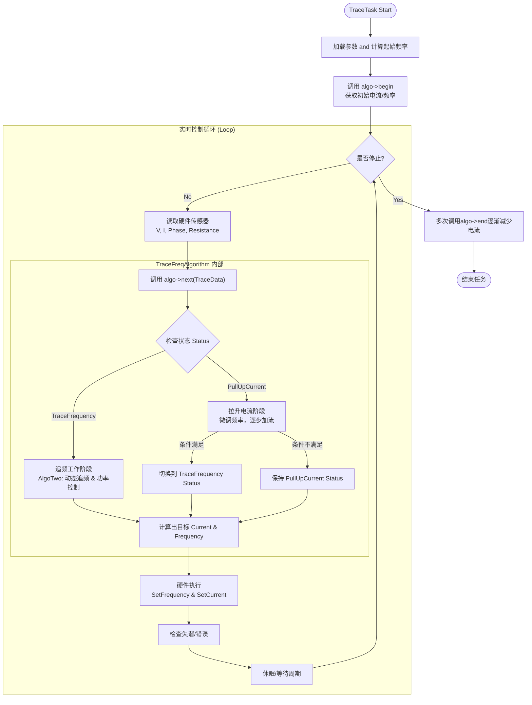

```mermaid
flowchart TD
    Start([TraceTask Start]) --> InitParam[加载参数 and 计算起始频率]
    InitParam --> AlgoBegin[调用 algo->begin<br>获取初始电流/频率]
    AlgoBegin --> LoopStart{是否停止?}
    
    subgraph "实时控制循环 (Loop)"
        LoopStart -- No --> ReadHW[读取硬件传感器<br>V, I, Phase, Resistance]
        ReadHW --> AlgoNext["调用 algo->next(TraceData)"]
        
        subgraph "TraceFreqAlgorithm 内部"
            AlgoNext --> StateCheck{检查状态 Status}
            StateCheck -- PullUpCurrent --> PullUp[拉升电流阶段<br>微调频率，逐步加流]
            StateCheck -- TraceFrequency --> TraceWork[追频工作阶段<br>AlgoTwo: 动态追频 & 功率控制]
            PullUp -- 条件满足 --> ChangeState[切换到 TraceFrequency Status]
            PullUp -- 条件不满足 --> StayState[保持 PullUpCurrent Status]
            TraceWork --> CalcOut[计算出目标 Current & Frequency]
            ChangeState --> CalcOut[计算出目标 Current & Frequency]
            StayState --> CalcOut[计算出目标 Current & Frequency]
        end
        
        CalcOut --> SetHW[硬件执行<br>SetFrequency & SetCurrent]
        SetHW --> CheckError[检查失谐/错误]
        CheckError --> Sleep[休眠/等待周期]
    end
    
    Sleep --> LoopStart
    LoopStart -- Yes --> AlgoEnd[多次调用algo->end逐渐减少电流]
    AlgoEnd --> Stop([结束任务])
```