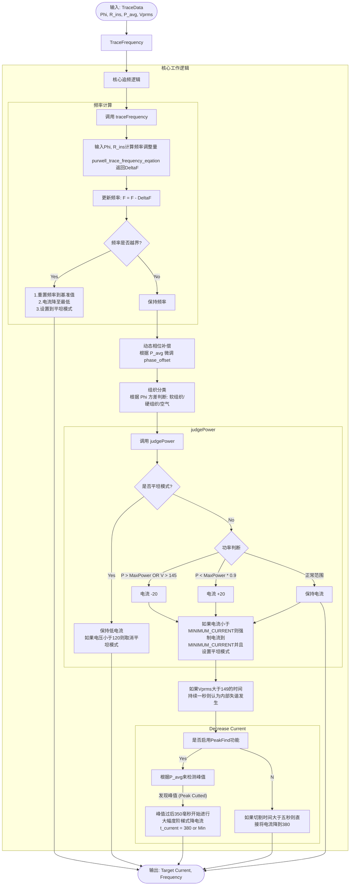

```mermaid
flowchart TD
    Input(["输入: TraceData <br> Phi, R_ins, P_avg, Vprms"]) --> TraceFrequency

    %% ================= 追频工作阶段 =================
    TraceFrequency --> CoreTrace["核心追频逻辑"]
    
    subgraph CoreTraceGroup["核心工作逻辑"]
        CoreTrace --> CalcFreq["调用 traceFrequency"]
        
        subgraph FreqCalcGroup["频率计算"]
            CalcFreq --> Eq["输入Phi, R_ins计算频率调整量 <br> purwell_trace_frequency_eqation <br> 返回DeltaF"]
            Eq --> UpdateF["更新频率: F = F - DeltaF"]
            UpdateF --> CheckBound{"频率是否越界?"}
            CheckBound -- Yes --> ResetF["1.重置频率到基准值<br>2.电流降至最低<br>3.设置到平坦模式"]
            CheckBound -- No --> PassF["保持频率"]
        end

        PassF --> PhaseAdjust["动态相位补偿<br>根据 P_avg 微调 phase_offset"]
        PhaseAdjust --> Classify["组织分类<br>根据 Phi 方差判断: 软组织/硬组织/空气"]
        
        Classify --> PowerCtrl["调用 judgePower"]
        
        subgraph PowerCtrlGroup["judgePower"]
            PowerCtrl --> CheckFlat{"是否平坦模式?"}
            CheckFlat -- Yes --> RetFlat["保持低电流<br>如果电压小于120则取消平坦模式"]
            CheckFlat -- No --> PidLogic{"功率判断"}

            PidLogic -- "P > MaxPower OR V > 145" --> DecCur["电流 -20"]
            PidLogic -- "P < MaxPower * 0.9" --> IncCur["电流 +20"]
            PidLogic -- "正常范围" --> KeepCur["保持电流"]
            DecCur & IncCur & KeepCur --> ReJudgeFlat["如果电流小于MINIMUM_CURRENT则强制电流到MINIMUM_CURRENT并且设置平坦模式"]
        end

        ReJudgeFlat --> InternalDetuned["如果Vprms大于149的时间持续一秒则认为内部失谐发生"]
        InternalDetuned --> PeakFind["是否启用PeakFind功能"]
        subgraph PeakGroup["Decrease Current"]
            PeakFind --Yes--> PeakDetect["根据P_avg来检测峰值"]
            PeakFind --No--> OtherDrop["如果切割时间大于五秒则直接将电流降到380"]
            PeakDetect -- "发现峰值 (Peak Cutted)" --> DropCur["峰值过后350毫秒开始进行大幅度阶梯式降电流<br>t_current = 380 or Min"]
        end
    end

    OtherDrop --> OutputParam
    DropCur --> OutputParam
    ResetF --> OutputParam
    RetFlat --> OutputParam
    KeepCur --> OutputParam

    OutputParam(["输出: Target Current, Frequency"])
```